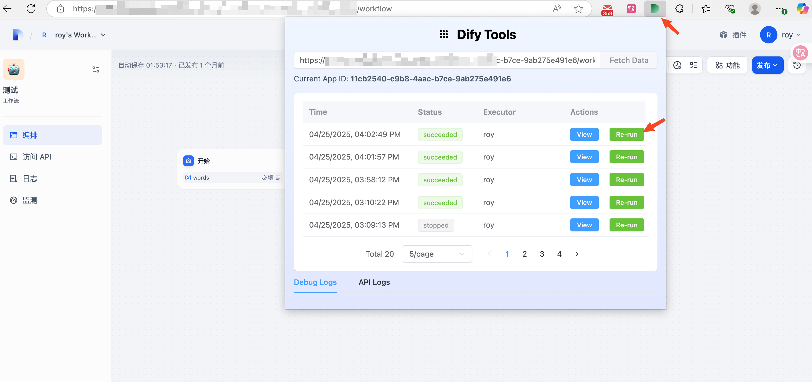
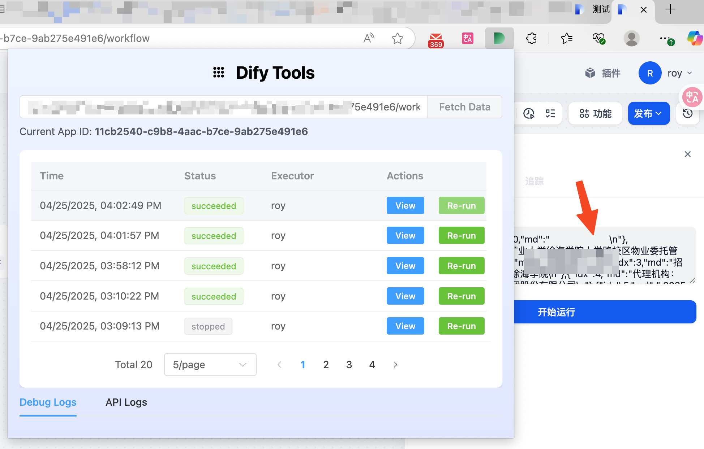

# Dify Tools - Your Dify Workflow Efficiency Assistant

 <!-- Please replace YOUR_EXTENSION_ID -->
 <!-- Assuming MIT License -->
[中文版](README.cn.md)

Dify Tools is a Chrome extension designed to help users debug Dify workflows more efficiently. It addresses the pain point of not being able to directly re-execute historical run records on the Dify debugging page, providing a "one-click re-run" feature to simplify testing iterations. The plugin also integrates a handy utility for quickly blurring image backgrounds.

## Main Features

### 🚀 Dify Workflow Assistant

The core function of this plugin is to serve as a powerful auxiliary tool for Dify workflows, making your development and debugging experience smoother.

#### 1. Workflow Run History Viewer
- **Convenient Access**: Click the Dify Tools icon in the browser toolbar to open the plugin interface in a new browser tab.
- **Smart Detection**: The plugin will attempt to automatically detect the Dify workflow URL in your current active browser tab and pre-fill it into the input field on the plugin interface. You can also manually enter or modify the target workflow URL.
- **Centralized Display**: Clearly displays the "Debug Logs" and "API Logs" of the specified Dify workflow, including key information such as run time, status, and executor.
- **Detail Tracing**: Easily view the detailed input and output of each run record (specific display depends on the Dify API response).

#### 2. One-Click Re-run (Core Feature) ✨
This is the most efficiency-boosting feature of Dify Tools! When you need to re-run a workflow with a previous parameter configuration, there's no need to manually copy and paste various parameters.

**Steps:**
1.  In the run history list on the plugin interface, find the record you want to re-run.
2.  Click the "Re-run" button corresponding to that record.
3.  The plugin will automatically populate all input parameters from that run into the corresponding parameter input fields of the Dify workflow page that is open in your current browser and matches the URL in the plugin.
4.  Then, the plugin will also automatically click the "Run" button on that Dify page.

**Effect**: Instantly completes parameter configuration and initiates the run, allowing you to focus on optimizing workflow logic and significantly reducing repetitive tasks.

<!-- It is recommended to embed a GIF animation here demonstrating the "One-Click Re-run" operation -->
<!--  -->

#### 3. Authentication Notice
- **Important**: To successfully fetch workflow run data from the Dify API, please ensure you are logged into the corresponding Dify console in your browser. The plugin needs to use the `console_token` stored by the Dify page after you log in for API authentication.

### 🖼️ Image Background Blur Tool
- **Quick Processing**: Right-click on an image on any webpage and select "Blur background" from the context menu.
- **Service Redirection**: The plugin will send the image URL to [imgkits.com](https://www.imgkits.com/) and open its background blur processing service page in a new tab.

## Installation

### Method 1: Build from Source (For Developers)
1.  Clone this repository locally: `git clone https://github.com/roylee1024/dify-tools.git` <!-- Please ask the user to replace roylee1024/dify-tools -->
2.  Navigate to the project directory: `cd dify-tools`
3.  Install dependencies: `pnpm install`
4.  Build the plugin: `pnpm build`
5.  Open Chrome/Edge browser, go to the extensions management page (`chrome://extensions` or `edge://extensions`).
6.  Enable "Developer mode".
7.  Click "Load unpacked" and select the `dist` folder in the project's root directory.

### Method 2: Download Release (Recommended)
1. Go to the project's [Releases page](https://github.com/roylee1024/dify-tools/releases). <!-- Please ask the user to replace roylee1024/dify-tools -->
2. Download the latest version of `dify-tools.zip` (or similarly named archive).
3. Unzip the downloaded ZIP file to a folder you can easily access.
4. Open Chrome/Edge browser, go to the extensions management page (`chrome://extensions` or `edge://extensions`).
5. Enable "Developer mode".
6. Click "Load unpacked" and select the folder you just unzipped.

## How It Works (Brief Introduction)
Dify Tools works through the coordination of several main parts:
- **Plugin Interface (Popup UI)**: Built with Vue 3, Element Plus, and Tailwind CSS, running in a separate browser tab. Users input Dify workflow URLs, view logs, trigger re-runs, etc., on this interface.
- **Background Script**: Responsible for handling plugin icon click events (opening the plugin interface and passing the URL), and creating/managing the right-click context menu (image blur feature).
- **Content Script**: Injected into the Dify workflow pages visited by the user. It is responsible for:
    - Reading the `console_token` from the Dify page's `localStorage` for API calls.
    - Receiving instructions from the plugin interface to fill parameters into the Dify page's input fields.
    - Simulating clicks on the "Run" button on the Dify page.

This design allows the plugin to provide convenient auxiliary functions without directly modifying Dify's core code.

## Tech Stack
- [Vue 3](https://vuejs.org/) (Composition API)
- [Element Plus](https://element-plus.org/)
- [Tailwind CSS](https://tailwindcss.com/)
- [Vite](https://vitejs.dev/)
- [Axios](https://axios-http.com/)
- [@crxjs/vite-plugin](https://crxjs.dev/vite-plugin)

## Feedback and Contribution
If you encounter any issues during use, or have feature suggestions, feel free to provide feedback via [GitHub Issues](https://github.com/roylee1024/dify-tools/issues). <!-- Please ask the user to replace roylee1024/dify-tools -->

We also welcome contributions of any kind! If you are interested in improving Dify Tools, please refer to the contribution guidelines (if `CONTRIBUTING.md` is created in the future).

---
Thanks for using Dify Tools! We hope it brings convenience to your Dify development journey. 